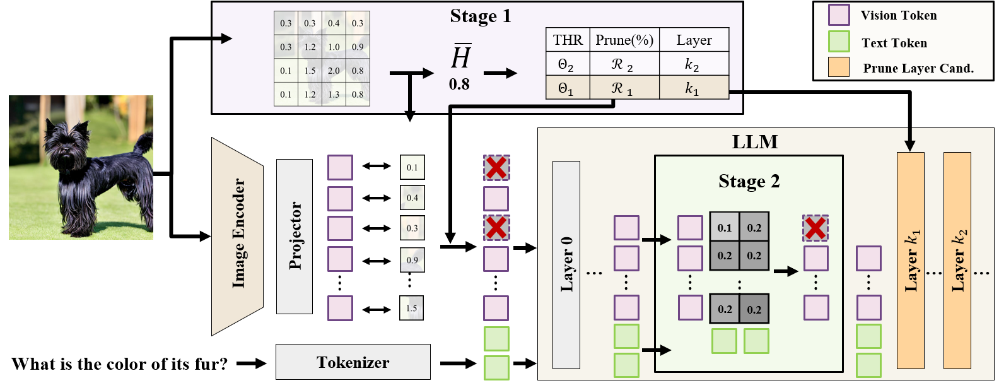

# ERASE: Eliminating Redundant Visual Tokens via Adaptive Two-Stage Token Pruning

## Overview



ERASE is a two-stage visual token pruning method for vision-language models. This repository provides the ERASE model implementation and an evaluation setup based on `VLMEvalKit`.

## Project Structure

- `models/`: ERASE model implementation.
- `VLMEvalKit/`: evaluation pipeline and model registration.

## Setup

```bash
git clone https://github.com/Tuna-Luna/ERASE.git
cd ERASE
conda create -n erase python=3.10
conda activate erase
cd VLMEvalKit
pip install -e .
pip install torch==2.8.0 torchvision==0.23.0
pip install transformers==4.57.3
pip install flash_attn --no-build-isolation
pip install bayesian-optimization
```

## Evaluation

Run the provided evaluation script from `VLMEvalKit/`:


### Main results from paper

```bash
cd VLMEvalKit
sh run_script.sh
```

### Bayesian Optimization

Before running Bayesian Optimization, first evaluate the baseline with `--policy base`. Then place the file containing the correctly answered sample indices at `models/bayes_search/indices.xlsx`.

```bash
cd VLMEvalKit
sh run_script_bayes.sh
```

### Argument Notes

- `--vision-token-num`: final vision-token retention ratio after pruning. For example, `0.25` keeps 25% of vision tokens and prunes 75%.
- `--policy`: inference mode. Use `base` for the baseline model, `erase` for ERASE, or `bayes` for Bayesian Optimization.
- `--entropy-threshold`: Stage-1 thresholds used to estimate image complexity.
- `--retain-ratio`: Stage-1 retention ratios for each image-complexity level. For example, `0.82` keeps 82% of tokens and prunes 18% in Stage 1.
- `--work-dir`: output directory for evaluation results.

For benchmark setup and evaluation details, see [VLMEvalKit](https://github.com/open-compass/VLMEvalKit).

## Implementation

- ERASE model implementation: [models/modeling_qwen2_5_vl_ERASE.py](models/modeling_qwen2_5_vl_ERASE.py)
- ERASE model registration in the evaluation pipeline: [VLMEvalKit/vlmeval/vlm/qwen2_vl/model.py](VLMEvalKit/vlmeval/vlm/qwen2_vl/model.py#L259)
