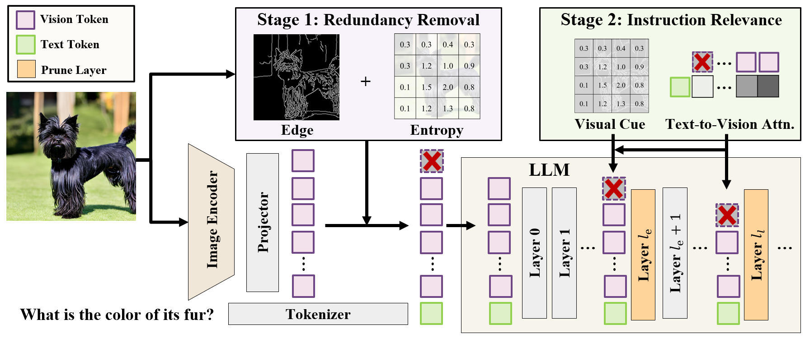

# ERASE: Eliminating Redundant Visual Tokens via Adaptive Two-Stage Token Pruning

## Overview



ERASE is a training-free two-stage visual token pruning method for vision-language models.
This repository is the official implementation of [ERASE](https://arxiv.org/abs/2605.09982), providing ERASE for Qwen2.5-VL, Qwen3-VL and InternVL3, and an evaluation setup based on `VLMEvalKit`.


## Project Structure

- `models/erase_utils.py`: stage-1 scoring (entropy / edge), the stage-2 schedule and the stage-2 score shared by all ports.
- `models/modeling_qwen2_5_vl_ERASE.py`, `models/modeling_qwen3_vl_ERASE.py`: ERASE models for Qwen2.5-VL and Qwen3-VL (stage 1, stage-2 planning, and the pruning decoder loop).
- `models/modeling_internvl_ERASE.py`: ERASE for InternVL3, derived at run time from the modelling code shipped with the checkpoint; stage 1 scores each image's local tiles and thumbnail separately.
- `models/image_processing_fast.py`: Qwen2-VL fast image processor that additionally exposes the resized images used by stage 1.
- `VLMEvalKit/`: evaluation pipeline; ERASE is registered in `VLMEvalKit/vlmeval/vlm/qwen2_vl/model.py`, `qwen3_vl/model.py` and `internvl/internvl_chat.py`.

## Setup

```bash
cd ERASE
conda create -n erase python=3.10
conda activate erase
cd VLMEvalKit
pip install -e .
pip install torch==2.8.0 torchvision==0.23.0
pip install transformers==4.57.3 accelerate==1.12.0 qwen-vl-utils==0.0.14
pip install flash_attn==2.8.3
```

Benchmark data is downloaded by VLMEvalKit on first use (see `VLMEvalKit/docs/en/Quickstart.md`).

## Evaluation

Run from `VLMEvalKit/`. `run_script.sh` reproduces the paper setting for the three retention ratios:
For other benchmarks other than "ChartQA_TEST TextVQA_VAL InfoVQA_VAL DocVQA_VAL", we recommend using judge model. 
For benchmark setup and evaluation details, see `VLMEvalKit/README.md` and `VLMEvalKit/docs/en/`.

```bash
cd VLMEvalKit
sh run_script.sh
```

### Supported models

`--policy erase` is supported for the models below (names as registered in `VLMEvalKit/vlmeval/config.py`). Stage 2 prunes at layer 2 and roughly two thirds of the decoder depth, so `--layer_list` depends on the number of decoder layers. All other arguments are shared.

| Model | Decoder layers | `--layer_list` |
| --- | --- | --- |
| `Qwen2.5-VL-7B-Instruct` | 28 | `2 19` |
| `InternVL3-8B` | 28 | `2 19` |
| `Qwen3-VL-8B-Instruct` | 36 | `2 24` |
| `Qwen3-VL-4B-Instruct` | 36 | `2 24` |
| `Qwen2.5-VL-3B-Instruct` | 36 | `2 24` |

### Arguments

| Argument | Default | Meaning |
| --- | --- | --- |
| `--policy` | `base` | `base` runs the stock model, `erase` enables ERASE. |
| `--retain-ratio` | `0.25` | Target fraction of vision tokens, averaged over all decoder layers (e.g. `0.25`, `0.35`, `0.45`). $\bar r$ in the paper. |
| `--weight` | `0.2` | Weight of the edge/entropy cue in the early stage-2 cut (in units of the attention score's standard deviation). $w$ in the paper. |
| `--edge_tau` | `0.45` | Stage-1 edge sensitivity: a pixel is an edge if its gradient exceeds `(1 - edge_tau)` x median intensity. $\tau$ in the paper. |
| `--layer_list` | `2 19` | Stage 2 pruning layers (`2 19` for 28-layer models, `2 24` for 36-layer models, see the table above). $(l_e, l_l)$ in the paper. |
| `--late-ratio` | `0.3` | Fraction of vision tokens kept by the late stage-2 cut. $r_l^{0}$ in the paper. |